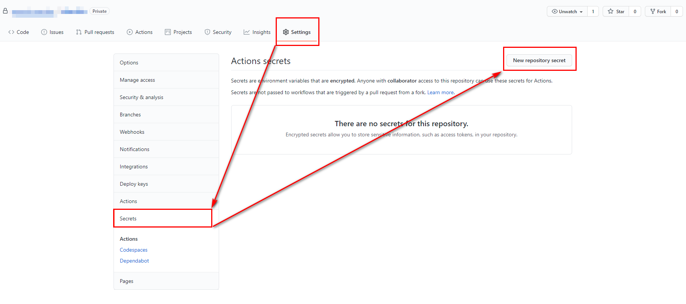
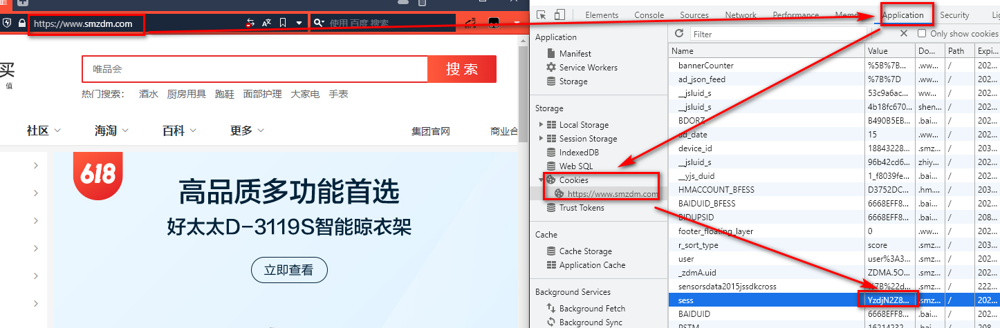

# 自动签到

使用github Actions自动签到, 每日定时触发, 仓库被star时也会触发, 可通过自已加星之后再取消来测试任务运行.

fork本仓库并设置好Secret后即可自动签到.

## 仓库secret设置

在如下位置新增secret, 输入相应的名称与值即可.

## 需设置secret

### 几鸡

| secret名称       | 说明       |
| :-:              | :-:        |
| CHICKEN_MAIL     | 几鸡用户名 |
| CHICKEN_PASSWORD | 几鸡密码   |

### 爱桌游

| secret名称           | 说明         |
| :-:                  | :-:          |
| LOVEZHUOYOU_USER     | 爱桌游用户名 |
| LOVEZHUOYOU_PASSWORD | 爱桌游密码   |

### 游戏时光

| secret名称      | 说明           |
| :-:             | :-:            |
| VGTIME_USER     | 游戏时光用户名 |
| VGTIME_PASSWORD | 游戏时光密码   |

### 旅法师营地

| secret名称       | 说明             |
| :-:              | :-:              |
| IYINGDI_USER     | 旅法师营地用户名 |
| IYINGDI_PASSWORD | 旅法师营地密码   |

### 什么值得买

| secret名称        | 说明                     |
| :-:               | :-:                      |
| SMZDM_SESS_COOKIE | 什么值得买 `sess` cookie |

该cookie获取方法, 打开什么值得买网站, *登录*后按 `F12` 进入控制台, 点击 `Application` -> `Cookies`, 找到名为 `sess` 的cookie即可.

### 哔哩哔哩

| secret名称               | 说明                       |
| :-:                      | :-:                        |
| BILIBILI_SESSDATA_COOKIE | 哔哩哔哩 `SESSDATA` cookie |

### 致美化

| secret名称      | 说明         |
| :-:             | :-:          |
| ZHUTIX_USER     | 致美化用户名 |
| ZHUTIX_PASSWORD | 致美化密码   |

### 鸟云

| secret名称       | 说明       |
| :-:              | :-:        |
| NIAOYUN_USER     | 鸟云用户名 |
| NIAOYUN_PASSWORD | 鸟云密码   |
